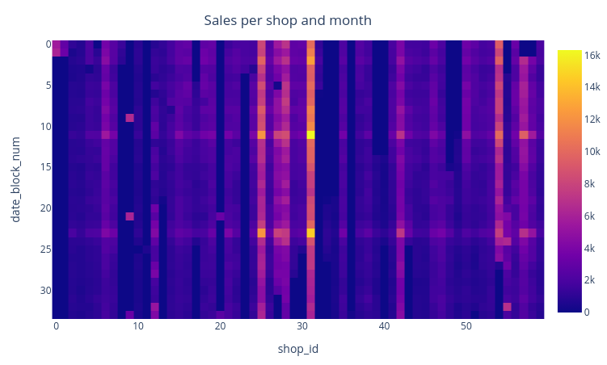
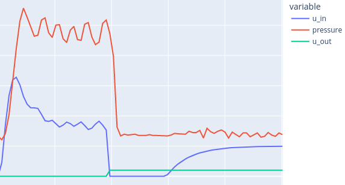
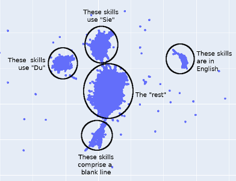

| COURSES                                                      |                                                              |
| ------------------------------------------------------------ | ------------------------------------------------------------ |
|       | [Udacity Nanodegree **Self-Driving Car Engineer**](https://cgebbe.github.io/udacity_nanodegree_selfdriving) |
|  | [Coursera course **Robotics: perception**](https://github.com/cgebbe/coursera_robotics_perception) |
|              | [Coursera course: How to win a **data science competition**](https://github.com/cgebbe/coursera_win_competition) |

 

| COMPETITIONS                                                 |                                                              |
| ------------------------------------------------------------ | ------------------------------------------------------------ |
|   | [Kaggle: **3D car detection**](https://github.com/cgebbe/kaggle_pku-autonomous-driving) |
|  | [Kaggle: Predict **future sales**](https://github.com/cgebbe/kaggle_predict_future_sales) |
|       | [Leetcode: Solved 143 **data structures and algorithms** puzzles](https://leetcode.com/cgebbe/) |
|  | [Kaggle: ventilator **pressure prediction**](https://github.com/cgebbe/kaggle_ventilator_pressure) |

 

| DEMOS                                                        |                                                              |
| ------------------------------------------------------------ | ------------------------------------------------------------ |
|                  | [Simple **SLAM** pipeline using opencv](https://github.com/cgebbe/demo_slam) |
|        | [Understanding **Adam** (the optimization algorithm)](https://github.com/cgebbe/demo_optimizer) |
|  | [**Style transfer** according to Gatys et al.](https://github.com/cgebbe/demo_style_gatys) |
|                | [Understanding **Bayes, Kalman and Particle filter**](https://github.com/cgebbe/demo_kalman) |
|            | [Clustering job postings using **BERT embeddings**](https://cgebbe.medium.com/clustering-job-postings-by-skills-b33e0ad579ff) |
|                | [Understanding **Bayes, Kalman and Particle filter**](https://github.com/cgebbe/demo_kalman) |

